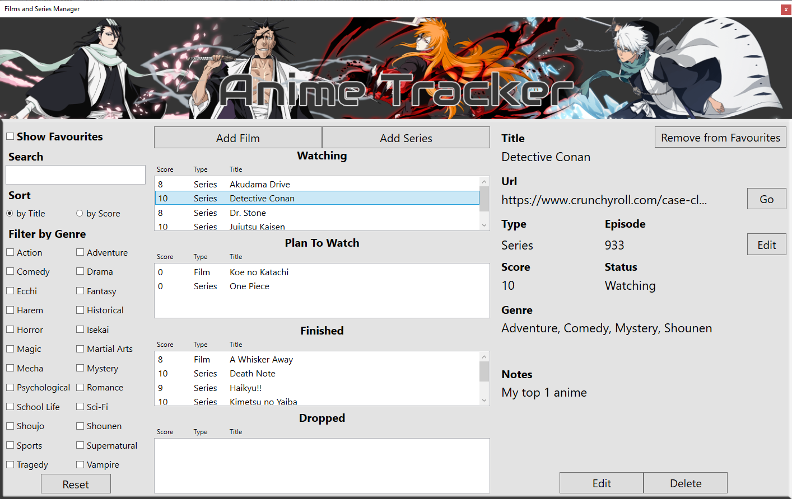
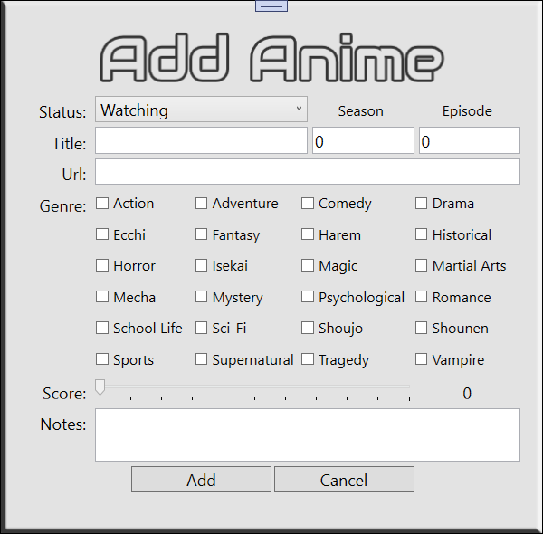
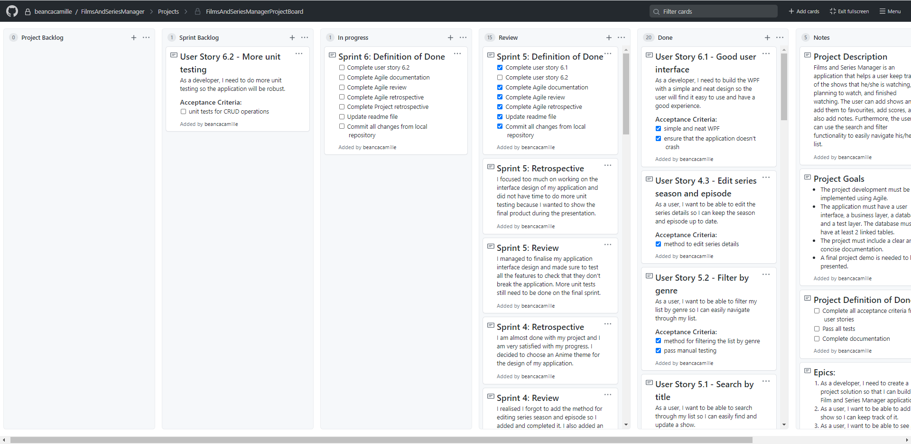
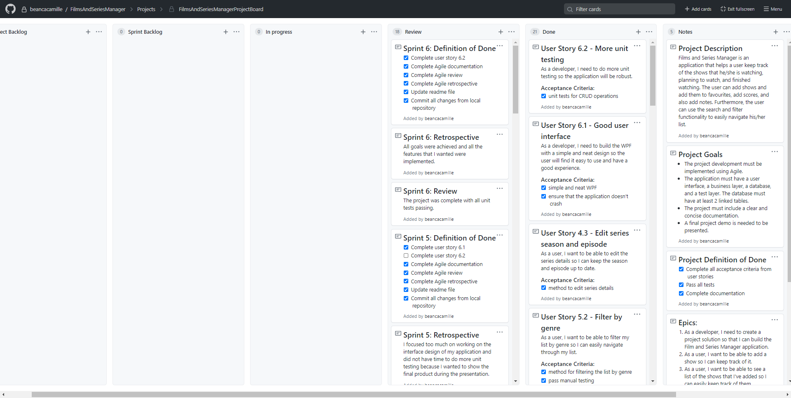

# FilmsAndSeriesManager
## Project Overview
### Project Description
Films and Series Manager is an application that helps a user keep track of the shows, specifically Anime, that he/she is watching, planning to watch, and finished watching. The user can add shows and add them to favourites, add scores, and also add notes. Furthermore, the user can use the search and filter functionality to easily navigate his/her list.
### Project Goals
- The project development must be implemented using Agile.
- The application must have a user interface, a business layer, a database, and a test layer. The database must have at least 2 linked tables.
- The project must include a clear and concise documentation.
- A final project demo is needed to be presented.
## Class Diagram

## WPF

## Unit Tests

## Sprint Breakdowns

### Sprint 1 - Tuesday 1st December 2020
I aimed to have a three level application with some CREATE operations on the business layer.
#### Sprint Goals
- [x] Complete user story 1.1 - Build a database
- [x] Complete user story 1.2 - Add an interface layer
- [x] Complete user story 1.3 - Add a business layer
- [x] Complete user story 2.1 - Add a film
- [x] Complete user story 2.2 - Add a series
- [x] Complete user story 2.3 - Assign genre to a show
- [x] Complete Agile documentation
- [x] Complete Agile review
- [x] Complete Agile retrospective
- [x] Update readme file
- [x] Commit all changes from local repository
#### Sprint Review
The database was completed and scaffolded using Entity Framework. There were some changes made when implementing business layer methods.
The [assigning of genre](https://github.com/beancacamille/FilmsAndSeriesManager/projects/1#card-50354314) took a lot of time to implement because of the complexity of joining many-to-many tables using a link table but I was able to complete all the user stories in the sprint backlog.
#### Sprint Retrospective
I did not expect the [assigning of genre](https://github.com/beancacamille/FilmsAndSeriesManager/projects/1#card-50354314) to be quite complex so it took me a lot of time to think of how to implement it efficiently. Time-boxing each user story would be very effective for increasing productivity.
On the other hand, I am getting more familiar with staging, committing, and pushing files to Github.

### Sprint 2 - Wednesday 2nd December 2020
I aimed to have most of the CRUD operations completed with unit testing and referenced in the user interface.
#### Sprint Goals
- [x] Complete user story 3.1 - Category lists
- [x] Complete user story 3.2 - Sort list
- [x] Complete user story 4.1 - Add show to favourites
- [x] Complete user story 4.2 - Edit show status
- [x] Complete user story 4.3 - Edit show details
- [x] Complete user story 4.4 - Delete show
- [x] Complete user story 2.1.1 - Add film interface
- [x] Complete user story 3.1.1 - Category lists interface
- [x] Complete Agile documentation
- [x] Complete Agile review
- [x] Complete Agile retrospective
- [x] Update readme file
- [x] Commit all changes from local repository
#### Sprint Review
I managed to complete all of the planned user stories in the sprint backlog and I added more user stories for creating the interfaces of adding a film and showing category lists. My blocker for this sprint was figuring out how to switch between different WPF windows but I was able to work it out in the end.
#### Sprint Retrospective
I planned to time-box each user story for 30 minutes each but some of the user stories were quite easy to do and related to other user stories. Whereas some took a lot more to do than the allocated time, so I still need to work on my time-boxing technique. Other than that, I think I am more than halfway complete with my project. I just need to complete 2 more functionalities then I can do more unit testing and interfaces which I will add to my project backlog.

### Sprint 3 - Thursday 3rd December 2020
I aimed to have all the basic interfaces and all the functionalities of my project completed by the end of this sprint.
#### Sprint Goals
- [x] Complete user story 2.2.1 - Add series interface
- [x] Complete user story 4.3.1 - Edit show interface
- [x] Complete user story 5.1 - Search by title
- [x] Complete user story 5.2 - Filter by genre
- [x] Complete Agile documentation
- [x] Complete Agile review
- [x] Complete Agile retrospective
- [x] Update readme file
- [x] Commit all changes from local repository
#### Sprint Review
I managed to complete all the planned user stories and I have completed all the functionalities of my project. I learned about passing data between different WPF windows when I was working on the Edit Show functionality. I also learned to use Tags to store additional information about a WPF element.
#### Sprint Retrospective
I spent a lot of time thinking of how to link the sort, search, and filter functionalities together but I managed to find a way  by repeatedly querying the same list for the search keyword and different genre, then sorting it.
With all the functionalities done, I can then focus on doing more unit tests and making the application presentable on the next sprint.

### Sprint 4 - Friday 4th December 2020
I aimed to write more unit tests and start editing the application interface design.
#### Sprint Goals
- [x] Complete user story 4.3 - Edit series season and episode
- [ ] Complete user story 6.1 - Good user interface
- [ ] Complete user story 6.2 - More unit testing
- [x] Complete Agile documentation
- [x] Complete Agile review
- [x] Complete Agile retrospective
- [x] Update readme file
- [x] Commit all changes from local repository
#### Sprint Review
I realised I forgot to add the method for editing series season and episode so I added and completed it. I also added an extra feature for opening up a browser with a specified url using Visual Studio. The rest of the time was spent doing more unit tests and editing the interface design which will be continued on to the next sprint.
#### Sprint Retrospective
I am almost done with my project and I am very satisfied with my progress. I decided to choose an Anime theme for the design of my application.

### Sprint 5 - Sunday 6th December 2020
I aimed to finalise the application interface and do more unit testing.
#### Sprint Goals
- [x] Complete user story 6.1 - Good user interface
- [ ] Complete user story 6.2 - More unit testing
- [x] Complete Agile documentation
- [x] Complete Agile review
- [x] Complete Agile retrospective
- [x] Update readme file
- [x] Commit all changes from local repository
#### Sprint Review
I managed to finalise my application interface design and made sure to test all the features to check that they don't break the application. More unit tests still need to be done on the final sprint.
#### Sprint Retrospective
I focused too much on working on the interface design of my application and did not have time to do more unit testing because I wanted to show the final product during the presentation.

### Sprint 6 - Monday 7th December 2020
I aimed to finish all the unit tests.
#### Sprint Goals
- [x] Complete user story 6.2 - More unit testing
- [x] Complete Agile documentation
- [x] Complete Agile review
- [x] Complete Agile retrospective
- [x] Update readme file
- [x] Commit all changes from local repository
#### Sprint Review
The project was complete with all unit tests passing.
#### Sprint Retrospective
All goals were achieved and all the features that I wanted were implemented.

## Project Review
The project is a success because all the project goals were reached. All user stories were completed and the application has passed both unit testing and manual testing. The project development was fully documented.
## Project Retrospective
I really enjoyed making this project and using Agile development throughout the whole process really helped me in organising and prioritising the features that I wanted to implement.\
I was able to put my coding and unit testing skills to practice while working on this project. I am now also more familiar with using Git and Github.
## Credits
The images that were used in the user interface were downloaded from:\
[Ichigo - pngfind](https://www.pngfind.com/mpng/bxwJRo_view-fullsize-hollow-ichigo-image-bleach-brave-souls/)\
[Hollow Ichigo - pngfind](https://www.pngfind.com/mpng/bxwmbh_view-fullsize-hollow-ichigo-image-hichigo-render-hd/)\
[Kenpachi - pngfind](https://www.pngfind.com/mpng/iwxTobT_kenpachi-zaraki-zaraki-kenpachi-brave-souls-hd-png/)\
[Byakuya - pngitem](https://www.pngitem.com/middle/oTToTo_byakuya-kuchiki-transparent-background-hd-png-download/)\
[Hitsugaya - dlpng](https://dlpng.com/png/7040538)